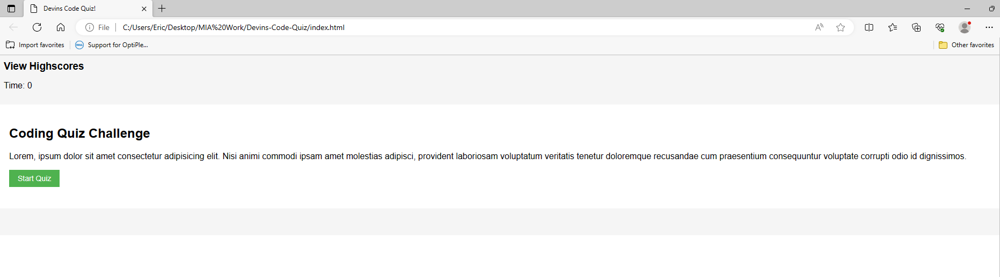

# <Coding Quiz>

## 

Provide a short description explaining the what, why, and how of your project. Use the following questions as a guide:

- What was your motivation?
- What did you learn?

## Table of Contents 

- [Installation](#installation)
- [Usage](#usage)
- [License](#license)

## Installation

What are the steps required to install your project? Provide a step-by-step description of how to get the development environment running.
Access the github link provided: https://github.com/Devinmarshill/Devins-Code-Quiz

## Usage

Allows users to take a quick 1 question quiz 

## Credits

AskBCS, Office Hours, TA, Instructor

## License

MIT license: [](https://opensource.org/licenses/MIT.

---
What was your motivation?

the motivation behind this project was to build out an interactive quiz that i can use to then build on to either build a questionaire using the new found knowledge of js.

What did you learn?

getting a grasp on the functions and how to call multiple functions within one such as starting the timer, but also showing the questions and learning how to then expand on that for future projects.

